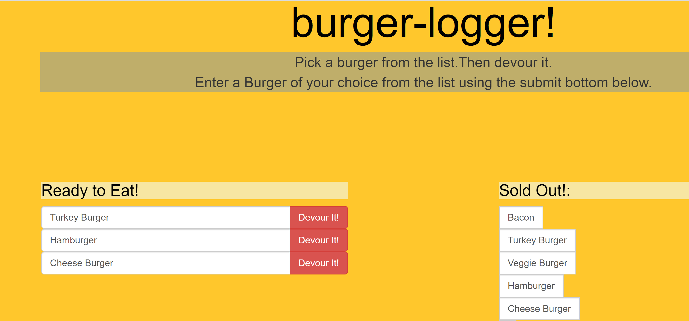
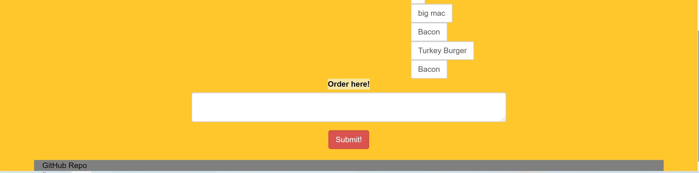

# burger logger

## Description
This application developed to create a burger logger with MySQL, Node, Express, Handlebars and a homemade ORM (yum!). This app work with installed Node Express Handlebars application following below.

* npm init

* npm install express

* npm install express-handlebars

* npm install mysql

* npm handlebars

   ## Table of Contents
   * [Installation Instructions](#installation-instructions)
   
   * [Usage Instructions](#usage-instructions)
   
   * [Contribution](#contribution)
   
   * [Developer Contact Information](#Developer-Contact-Information)
     
  * [License](#license)

  ## Installation Instructions
The developer is authorizing a free installation by cloning from the code [negasimichael](https://github.com/negasimichael/burger-logger).
   
   ## Usage Instructions
   You can order your sandwich by typing in the input and submit. The order gets saved in the data base and it is shown in the left side until the devour it button is hit. Once the devour it button is clicked the order is send to the right side of the page where it is saved as the devour processed data.

## Contribution
  [negasimichael](https://github.com/negasimichael/burger-logger/) is the only contrubuter of this project .

   ## Developer Contact Information
  * Linkedin Profile: [negasimichael](https://www.linkedin.com/feed/)
  * Deployed URL: [negasimichael](https://burgerapp124.herokuapp.com/index)
  * Github URL: [negasimichael](https://github.com/negasimichael/burger-logger)
  * Email: negasimichael1@gmail.com
  
## License
   .
 
 ------------------------------------------------------------------------------
© 2021 Trilogy Education Services, a 2U, Inc. brand. All Rights Reserved.